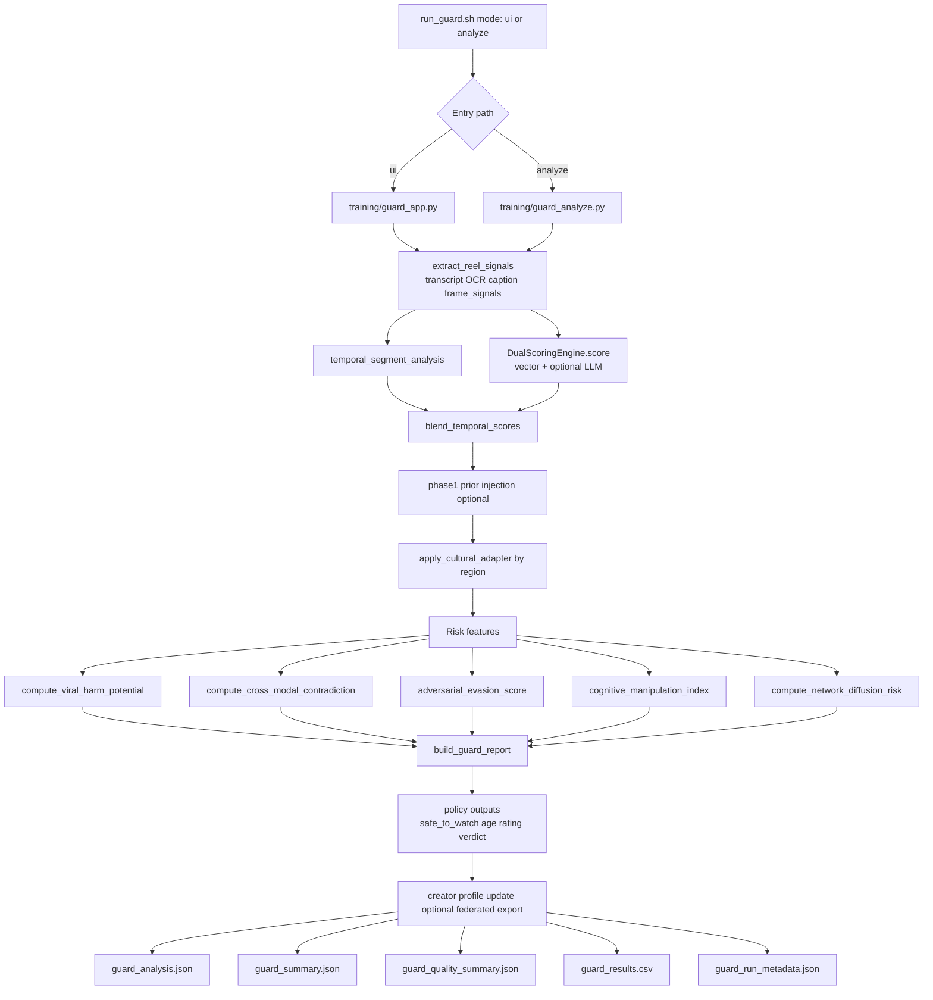

# Guard Legacy Runtime Architecture

This diagram reflects the currently active production path that generates fields such as average_good_for_society and average_sbi in guard_summary.json.

## Diagram

## Main Modules

- Entry and mode routing: training/guard_analyze.py and training/guard_app.py
- Multimodal extraction: training/guard_multimodal.py
- Semantic scoring engine: training/guard_scoring.py
- Temporal risk blending: training/guard_temporal.py
- Platform risk and adaptation: training/guard_platform.py
- Final report shaping: training/guard_report.py
- Summary and artifact writing: training/guard_analyze.py

## Why this is the active path

The summary file currently open in your editor contains keys from this path:
- average_good_for_society
- average_sbi

Those fields are built by _build_summary in training/guard_analyze.py, not by V2 reporting.
