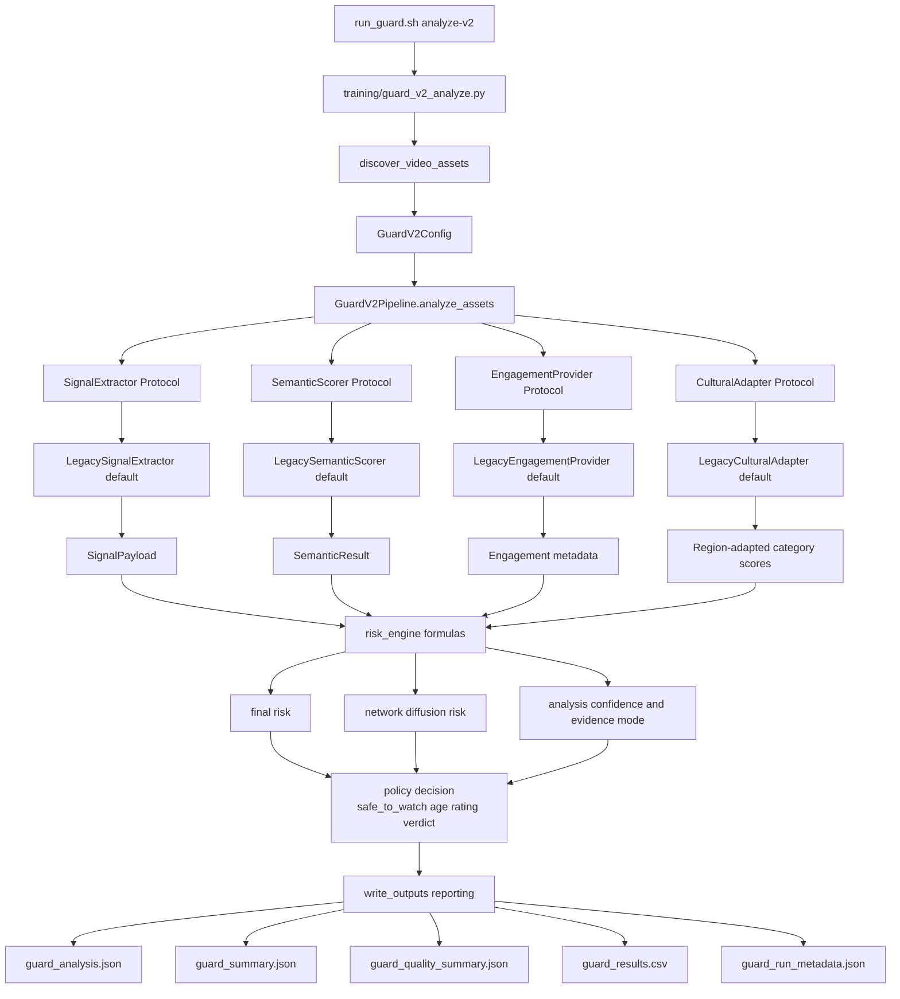
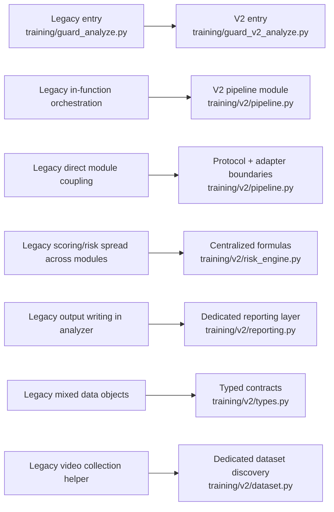

# Guard V2 Migration Architecture

This page shows the target V2 runtime and how legacy components map into the new layered pipeline.

## Target V2 Runtime

## Migration Map (Legacy to V2)

## Why this migration architecture matters

- Clear layered boundaries reduce regression risk.
- Dependency injection enables safer module replacement.
- Risk formulas are centralized and auditable.
- Reporting is isolated from scoring logic.
- Failed items and insufficient evidence are explicitly handled.
